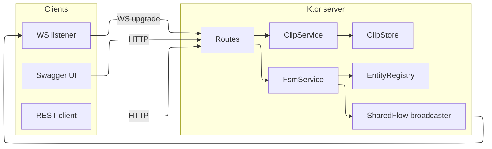
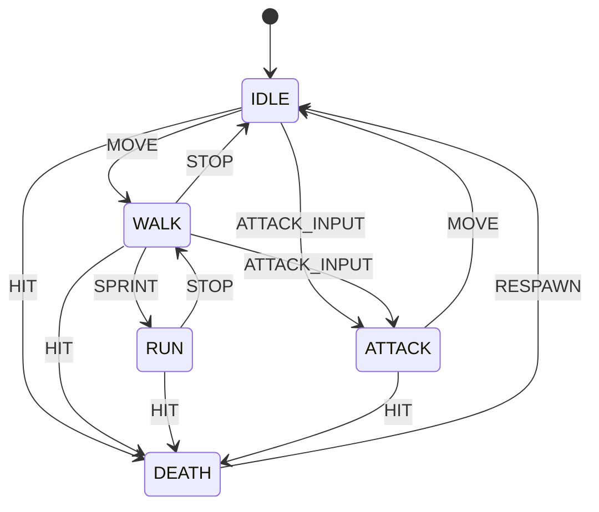
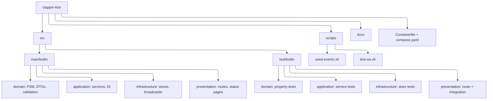
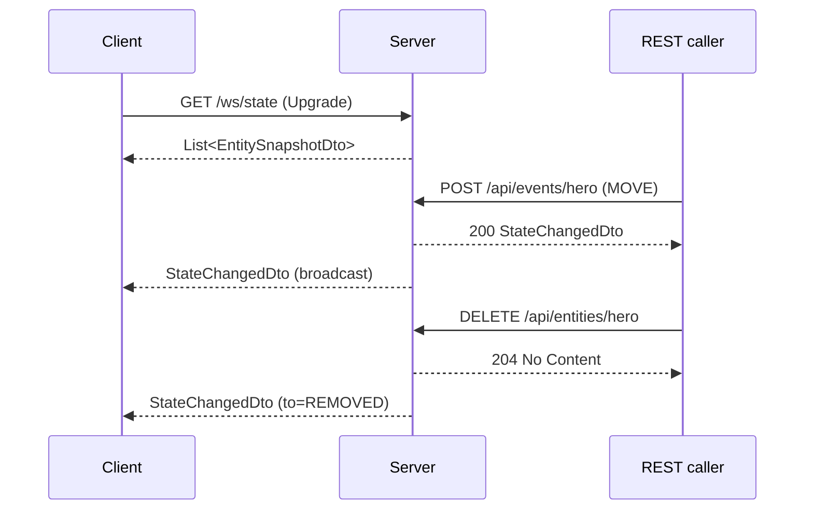
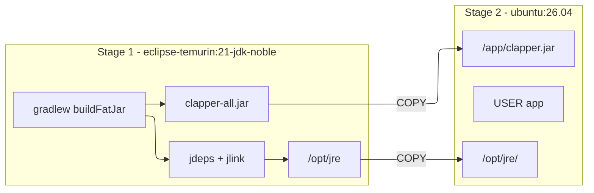
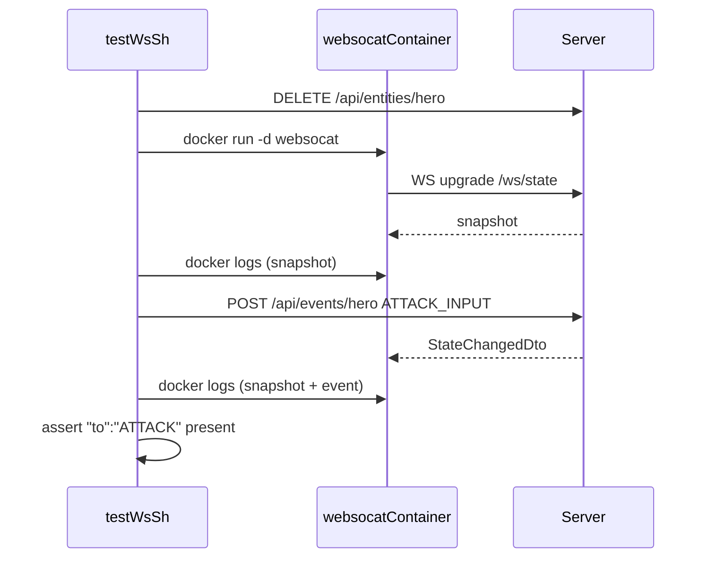

# clapper-ktor

Authoritative animation FSM server for game entities, with a CRUD library
of animation clips. Built on Kotlin + Ktor, exposes REST + WebSocket APIs,
ships as an OCI container image.

See [`docs/SPEC.md`](docs/SPEC.md) for the full specification.

## Overview

The server keeps the source of truth for animation state machines of
game entities (`hero`, `enemy_1`, `enemy_2`, ...). Clients dispatch
events over REST; valid transitions update entity state and broadcast
a `StateChangedDto` to all WebSocket subscribers in real time.

A separate, unrelated subsystem provides a CRUD library of animation
clips (name, target state, duration, loop, tags) so a designer can
manage the asset catalog without touching game code.

## Architecture



## State machine



Transitions not on the diagram are rejected with `409 Conflict`.

## Tech stack

- Kotlin 2.x on JVM 21
- Ktor (Netty engine, WebSockets, OpenAPI, Swagger, Status Pages,
  Content Negotiation, Request Validation, Call Logging, Call ID)
- kotlinx.serialization for JSON
- Kotest + ktor-server-test-host for tests
- Gradle 9.x with the Kotlin DSL
- ktlint for style

## Project layout



## API surface

| Method | Path                       | Purpose                          |
|--------|----------------------------|----------------------------------|
| POST   | `/api/events/{entityId}`   | Dispatch FSM event               |
| GET    | `/api/entities`            | List all entity snapshots        |
| DELETE | `/api/entities/{entityId}` | Remove entity, broadcast REMOVED |
| POST   | `/api/clips`               | Create animation clip            |
| GET    | `/api/clips[?state=X]`     | List clips, optional state       |
| GET    | `/api/clips/{id}`          | Get clip by UUID                 |
| PUT    | `/api/clips/{id}`          | Replace clip                     |
| DELETE | `/api/clips/{id}`          | Delete clip                      |
| WS     | `/ws/state`                | Snapshot + StateChangedDto feed  |
| GET    | `/swagger`                 | Swagger UI                       |
| GET    | `/api/openapi.json`        | Raw OpenAPI document             |

### WebSocket session



## Build and run

### Local (Gradle)

Requires JDK 21+. The wrapper bootstraps Gradle itself.

```bash
./gradlew build         # compile, ktlint, tests
./gradlew run           # start the server on :8080
./gradlew buildFatJar   # produce the runnable JAR
```

Once running:

```
INFO  Application - Application started in 0.303 seconds.
INFO  Application - Responding at http://0.0.0.0:8080
```

### Container (OCI)

The `Containerfile` is a two-stage build:

1. `eclipse-temurin:21-jdk-noble` builds the fat JAR with Gradle and
   produces a custom JRE via `jdeps` + `jlink` containing only the
   modules the application actually needs (plus `jdk.unsupported`,
   `jdk.crypto.ec`).
2. `ubuntu:26.04` copies the JRE and the JAR into a minimal runtime
   stage. Runs as non-root user `app`.



Build and run with Docker Compose:

```bash
docker compose build
docker compose up -d
docker compose logs -f
docker compose down
```

The Compose service:

- exposes port `8080`
- limits memory to `256M` and CPU to `1.0`
- has an HTTP healthcheck on `/api/entities`
- runs `read_only` with a small `tmpfs` on `/tmp` (with `exec`)
- applies `no-new-privileges`

## Scripts

Two helper scripts live under `scripts/`. Both default to
`localhost:8080` and accept `host` and `port` as positional
arguments: `./scripts/<name>.sh some-host 9090`.

### `scripts/seed-events.sh`

Pure `curl`. Resets the seeded entities and walks `hero` through the
full FSM cycle, then drives `enemy_1` to `DEATH`.

```bash
./scripts/seed-events.sh
```

### `scripts/test-ws.sh`

WebSocket smoke-test. Opens `/ws/state` via an ephemeral
`ghcr.io/vi/websocat:latest` container (so no host-side WebSocket
client is required), prints the initial snapshot, dispatches
`ATTACK_INPUT` to `hero` and verifies the broadcast contains
`"to":"ATTACK"`.

```bash
./scripts/test-ws.sh
```



Requirements:

- `docker` available (the script runs websocat in a container)
- on macOS Docker Desktop, `host-gateway` resolves automatically;
  on Linux you may need `--network host` or the host IP if the
  default `--add-host=host-gateway:host-gateway` does not reach
  the host

## Testing

```bash
./gradlew test          # unit + property + integration tests
./gradlew ktlintCheck   # style
./gradlew clean build   # everything
```

Test layout:

- `domain/` property tests (Kotest)
- `application/` service-level property tests
- `infrastructure/` store property tests
- `presentation/` route and full integration tests using
  `testApplication { ... }`

## Out of scope (MVP)

- Persistence (state and clips are in-memory)
- Authentication and authorization
- Horizontal scaling
- Linking clips to FSM transitions
