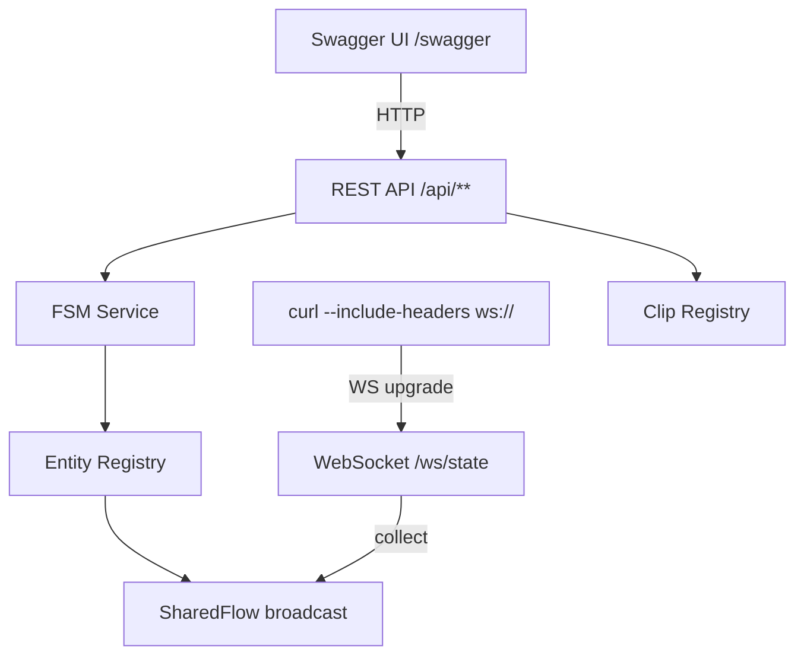
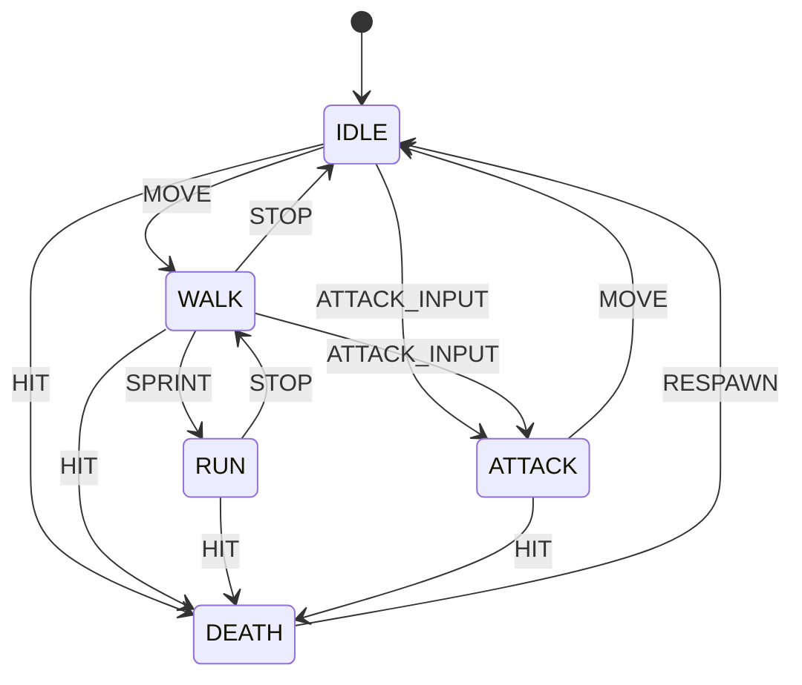
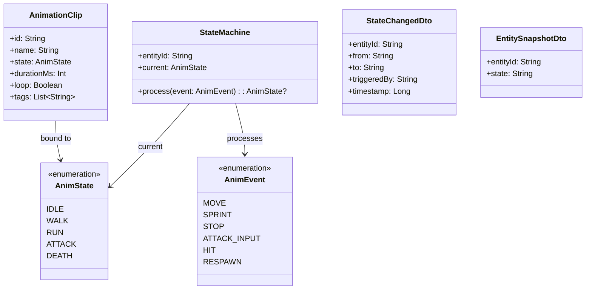
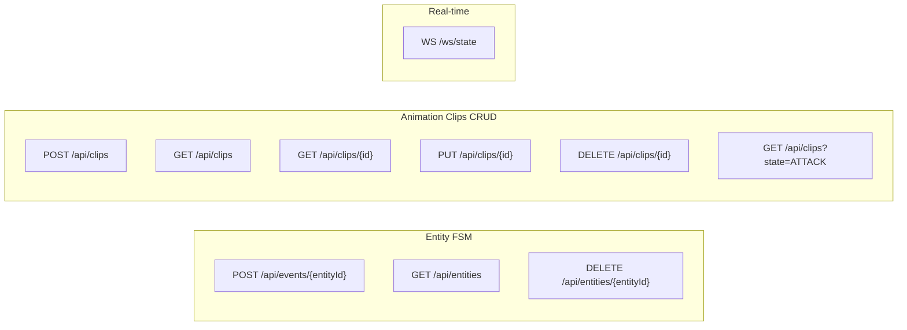
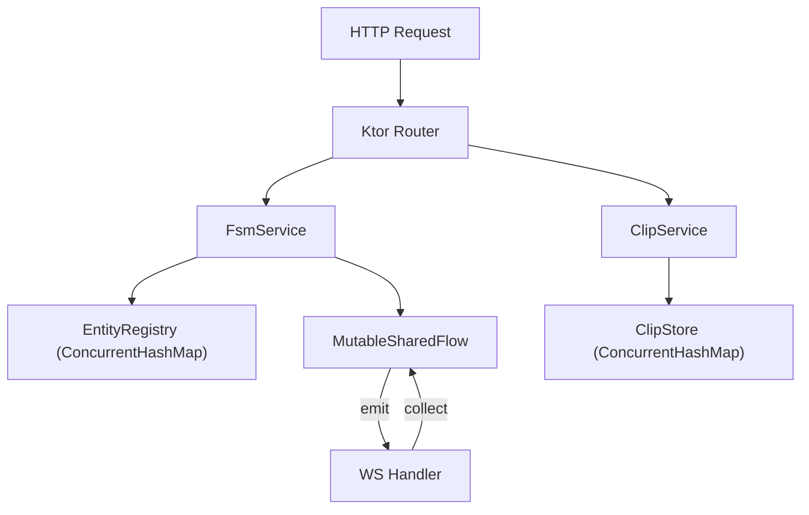

# SPEC

## §1. Обзор продукта

Сервер является **авторитетным источником** состояния анимационных машин состояний FSM для набора игровых сущностей. Поверх FSM реализован CRUD для библиотеки анимационных клипов — дизайнер может добавлять, редактировать и удалять клипы, не трогая игровой код.

**Технологический стек:**

- Доменная часть: Ktor, Kotlin
- Клиентская часть: OpenAPI + Swagger UI (отдаётся на `/swagger`)
- Тестирование: `ktor-server-test-host` (unit) + `curl` (WebSocket smoke-test)

**Фронтенд:** отсутствует. Единственный UI — Swagger. Визуализация работы сервера
производится через Swagger-формы и WebSocket-сессию в терминале.

## §2. Архитектура



## §3. Доменная модель

### 3.1 Машина состояний персонажа



Переходы, не указанные на диаграмме, **запрещены** — сервер возвращает `409 Conflict`.

### 3.2 Сущности и DTO



## §4. API

### 4.1 Карта эндпоинтов



### 4.2 Поведение эндпоинтов

**Entity FSM:**

| **Метод** | **Путь**                   | **Успех**                     | **Ошибки**                                     |
|-----------|----------------------------|-------------------------------|------------------------------------------------|
| POST      | `/api/events/{entityId}`   | 200 `StateChangedDto`         | 409 запрещённый переход, 400 неизвестный event |
| GET       | `/api/entities`            | 200 `List<EntitySnapshotDto>` | —                                              |
| DELETE    | `/api/entities/{entityId}` | 204                           | 404 не найден                                  |

**Animation Clips CRUD:**

| **Метод** | **Путь**          | **Успех**                                                       | **Ошибки**          |
|-----------|-------------------|-----------------------------------------------------------------|---------------------|
| POST      | `/api/clips`      | 201 `AnimationClip` с generated id                              | 400 невалидное тело |
| GET       | `/api/clips`      | 200 `List<AnimationClip>`, query-param `?state=` для фильтрации | —                   |
| GET       | `/api/clips/{id}` | 200 `AnimationClip`                                             | 404                 |
| PUT       | `/api/clips/{id}` | 200 `AnimationClip`                                             | 404, 400            |
| DELETE    | `/api/clips/{id}` | 204                                                             | 404                 |

**WebSocket `/ws/state`:**

1. При подключении сервер немедленно шлёт `List<EntitySnapshotDto>` (текущий снимок)
2. После каждого FSM-перехода шлёт `StateChangedDto` всем подключённым клиентам
3. При `DELETE /api/entities/{id}` шлёт `StateChangedDto` с полем `to = "REMOVED"`

### 4.3 Swagger

- Swagger UI доступен на `/swagger`
- OpenAPI JSON доступен на `/api/openapi.json`
- Все эндпоинты снабжены описаниями и примерами request/response body

## §5. Сервисный слой



**EntityRegistry:**

- Хранит `ConcurrentHashMap<String, StateMachine>`
- При `dispatch(entityId, event)`: атомарное чтение+запись состояния машины через `synchronized(stateMachine)`, затем emit в SharedFlow — иначе между read и write есть гонка даже при ConcurrentHashMap
- `getOrCreate(id)` — неизвестные entityId создаются автоматически с состоянием IDLE
- При старте приложения инициализировать сущности: `hero`, `enemy_1`, `enemy_2`

**SharedFlow:**

- Создаётся с `extraBufferCapacity = 64`, чтобы медленный WS-клиент не блокировал emit
- Начальный снимок при подключении отдаётся отдельно (из EntityRegistry), а не через replay, чтобы не смешивать снимок и поток событий

**ClipStore:**

- Хранит `ConcurrentHashMap<String, AnimationClip>`
- ID генерируется сервером (`UUID.randomUUID()`)
- Фильтрация по `state` реализуется в памяти
- При старте инициализировать 2-3 seed-клипа для демонстрации

## §6. Скрипты тестирования

### 6.1 WebSocket smoke-test (`scripts/test-ws.sh`)

Скрипт должен:

1. Подключиться к `ws://localhost:8080/ws/state` через `curl --no-buffer`
2. Распечатать начальный снимок
3. В параллельном процессе отправить `POST /api/events/hero` с событием `ATTACK_INPUT`
4. Убедиться, что WebSocket-сессия получила `StateChangedDto` с `to = "ATTACK"`
5. Завершить соединение

### 6.2 Seed-скрипт (`scripts/seed-events.sh`)

Последовательность curl-запросов для демонстрации полного цикла FSM:

```other
hero:    IDLE → MOVE → WALK → SPRINT → RUN → STOP → WALK → ATTACK_INPUT → ATTACK → MOVE → IDLE → HIT → DEATH → RESPAWN → IDLE
enemy_1: IDLE → ATTACK_INPUT → ATTACK → HIT → DEATH
```

## §7. Зависимости (build.gradle.kts)

Ядро и транспорт

| **Артефакт**                 | **Плагин** | **Назначение**                |
|------------------------------|------------|-------------------------------|
| `ktor-server-core-jvm`       | —          | Ядро сервера                  |
| `ktor-server-netty-jvm`      | —          | Netty engine                  |
| `ktor-server-websockets-jvm` | WebSockets | Двунаправленные WS-соединения |

HTTP

| **Артефакт**                          | **Плагин**          | **Назначение**                              |
|---------------------------------------|---------------------|---------------------------------------------|
| ~~`ktor-server-cors-jvm`~~            | ~~CORS~~            | ~~Разрешить запросы с других origin (dev)~~ |
| `ktor-server-default-headers-jvm`     | Default Headers     | Стандартные заголовки безопасности          |

Документация API

| **Артефакт**              | **Плагин**          | **Назначение**                  |
|---------------------------|---------------------|---------------------------------|
| `ktor-server-openapi-jvm` | OpenAPI (JetBrains) | Генерация и отдача OpenAPI JSON |
| `ktor-server-swagger-jvm` | Swagger (JetBrains) | Swagger UI на `/swagger`        |

Роутинг и валидация

| **Артефакт**                             | **Плагин**           | **Назначение**                        |
|------------------------------------------|----------------------|---------------------------------------|
| `ktor-server-request-validation-jvm`     | Request Validation   | Валидация входящих запросов           |
| `ktor-server-status-pages-jvm`           | Status Pages         | Централизованная обработка исключений |

Сериализация

| **Артефакт**                          | **Плагин**            | **Назначение**                  |
|---------------------------------------|-----------------------|---------------------------------|
| `ktor-server-content-negotiation-jvm` | Content Negotiation   | Автоконвертация по Content-Type |
| `ktor-serialization-kotlinx-json-jvm` | kotlinx.serialization | JSON-сериализация               |

Мониторинг

| **Артефакт**                   | **Плагин**   | **Назначение**                        |
|--------------------------------|--------------|---------------------------------------|
| `ktor-server-call-logging-jvm` | Call Logging | Логирование входящих запросов         |
| `ktor-server-call-id-jvm`      | Call ID      | Идентификация запросов (X-Request-ID) |

Тесты

| **Артефакт**                | **Назначение**                             |
|-----------------------------|--------------------------------------------|
| `ktor-server-test-host-jvm` | `testApplication {}` без реального сервера |
| `kotlin-test-junit`         | JUnit assertions                           |

## §8. Out of scope (MVP)

- Персистентность: состояния и клипы хранятся только в памяти, при рестарте сбрасываются *(допустимо для MVP: цель работы — FSM и real-time, а не слой данных)*
- Аутентификация и авторизация
- Горизонтальное масштабирование (нет Redis / distributed state)
- Привязка клипов к переходам FSM (клипы и FSM — независимые подсистемы)
- Валидация бизнес-правил при обновлении клипа (например, уникальность имени)
